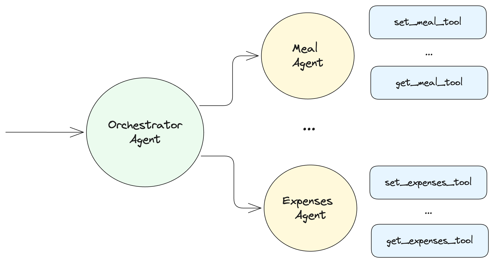

# LangGraph Handoff Example Project
This project demonstrates the use of the handoff library to create swarm-style multi-agent systems for managing team expenses and meal planning.

## Features

- **Main Agent**: Entry point that routes requests to specialized agents
- **Expenses Agent**: Specialized in handling expense-related tasks. Manages and tracks team expenses in Argentinian style.
- **Meal Planning Agent**: Specialized in meal planning and organization. Helps plan and organize team meals with clear, direct responses.

## Architecture

This project uses a swarm architecture where agents dynamically hand off control to one another based on their specializations. The system remembers which agent was last active, ensuring that on subsequent interactions, the conversation resumes with that agent.

